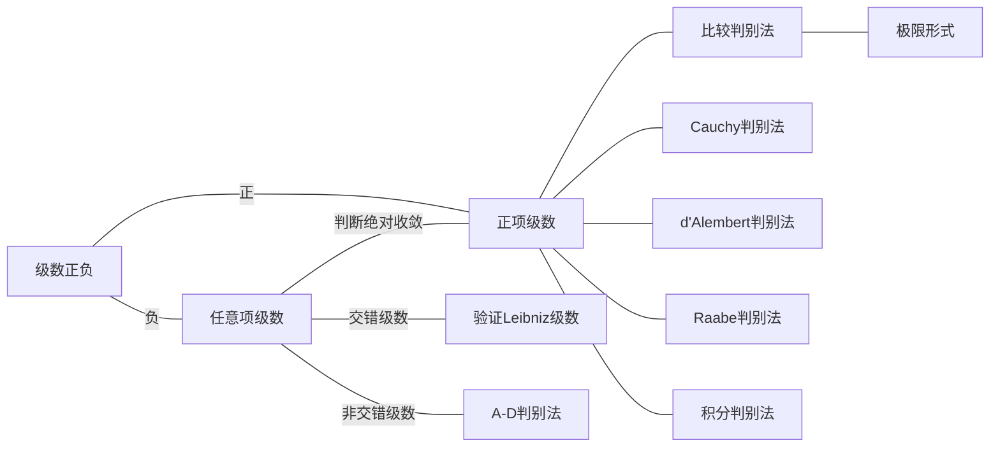

# 1. 第一步：分析结构

## 1.1. 例：$\displaystyle\sum\limits_{n=1}^{\infty}\dfrac{1}{\sqrt{ n }}\cos(\dfrac{n \pi}{3})$
解
- 可分为 $\dfrac{1}{\sqrt{ n }}$ 和 $\cos \dfrac{n \pi}{3}$

## 1.2. 例：$\displaystyle\sum\limits_{n=1}^{\infty}(-1)^{n+1}\dfrac{4^n \sin^{2n}x}{n}$
解
- 可分为 $(-1)^{n+1}$，$\dfrac{1}{n}$，$(4 \sin^2 x)^n$
- 可分为 $(-1)^{n+1}$，$\dfrac{1}{n}$，$(2 \sin x)^{2n}$
	- 参考 [[常用麦克劳林级数展开]]，可延伸到 $\ln(1+x)$ 的展开，利用收敛域反解 $x$ 的取值范围（需要用到幂级数知识）
	- 可延伸到 $\ln(1+x)$ 的展开

# 2. 任意项级数的策略

## 2.1. 判断绝对收敛
1. 主体部分套上绝对值
2. 用 [[正项级数]] 的方法验证收敛
3. 若有外部变量 $x$，还要根据各种判敛法的临界点反解出 $x$ 的取值范围

## 2.2. 交错级数判断Leibniz级数
1. 是交错级数
2. 主体部分验证数列单调递减趋于零

## 2.3. 三角函数

1. 利用周期性铺开全周期的数值，观察是否能合并成交错级数
2. 积化和差凑出望远镜级数

# 3. 可视化

